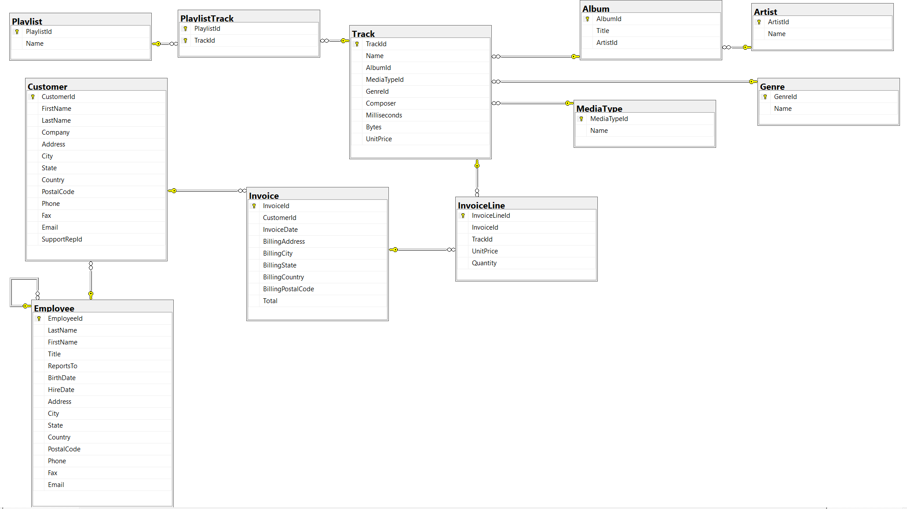
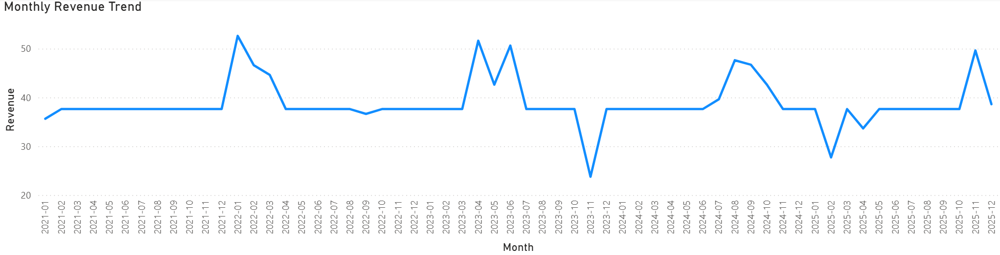
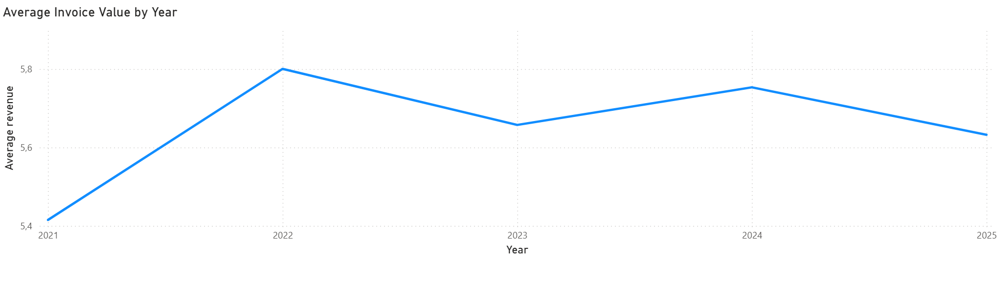
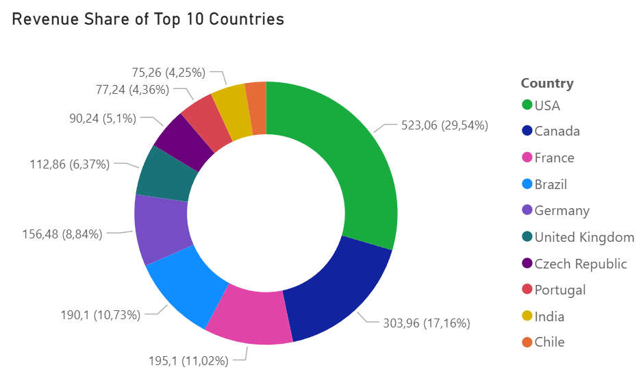
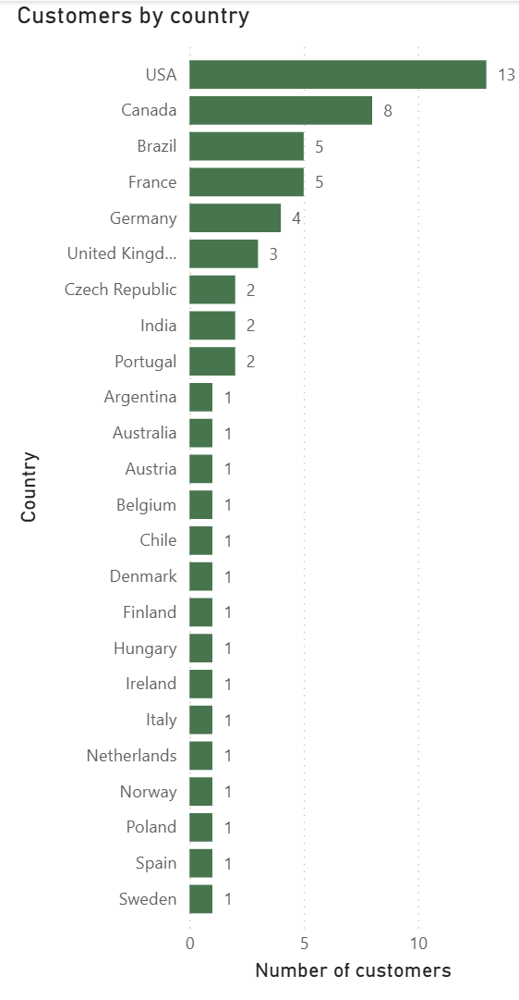
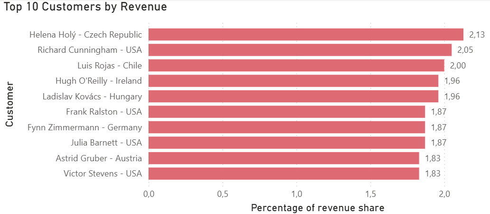
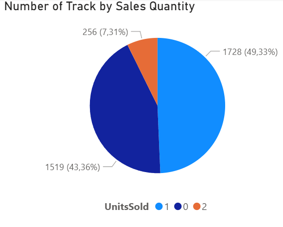
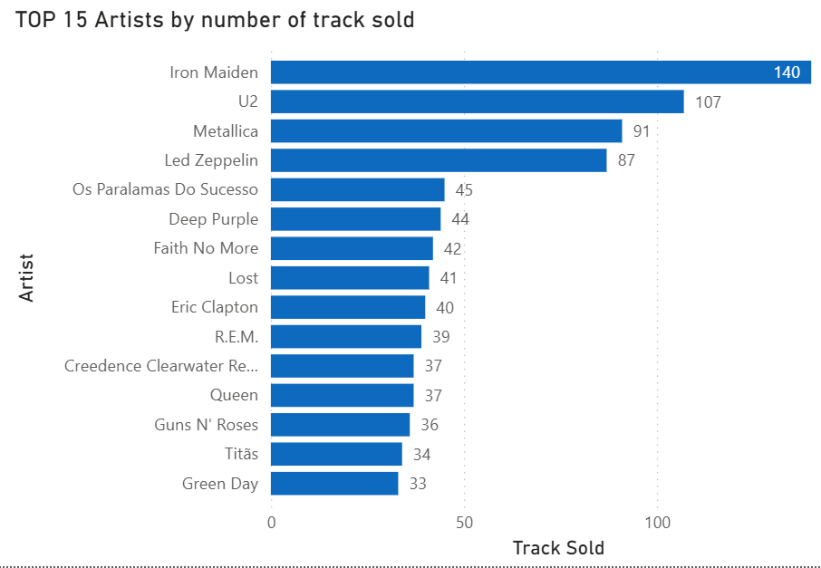
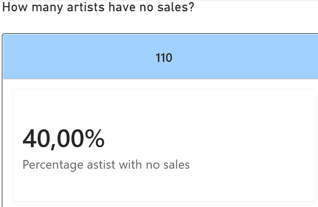

# sales-revenue-data-analysis
Sales and Revenue Performance Data Analysis using SQL Server and T-SQL

## Workflow
1.	Business understanding
2.	Data exploration
3.	Data quality check
4.	Revenue analysis
   (total revenue trends, average revenue, revenue per country
5. Customer analysis
   (customers by country, top 10 customers by revenue and the percentage of revenue share)
6. Product and artist analysis
   (track sales overview, the best artists, artists with no sales)
7. Dashboards (The “dashboard” file contains charts that are described in the README.)

## Technologies
- Microsoft SQL Server
- T-SQL
- SQL Server Management Studio (SSMS)
- Power BI

## Dataset  
Chinook Database from lerocha (Chinook_SqlServer.sql)

## Analysis 

### Business understanding
The project aims to help to make business decisions according to sales, to indicate the most engaged clients to bonus them and to encourage more future buying. Additionally, the analysis will identify which countries with the lowest sales, which could help the company target these markets with advertising campaigns. It will help to find out sales weaknesses. The purpose is to answer some of the questions. Present the revenue regarding each year. How does the revenue change over time? Which countries and customers generate the highest revenue? Which artists and tracks generate the highest sales? Indicate and analyze KPI. Present some details regarding revenue and sales using some dashboards.

### Data exploration
See data_exploration.sql for the complete SQL code.

## 

There are 11 tables with some relationships between them. There are Primary Keys and Foreign keys. 
Each table has a primary key for unique identification. Foreign keys are used to define relationships between tables. The use of foreign keys enforces relational integrity between tables.
All queries are attached (.sql files).
Data types are checked. During this analysis procedure the most essential tables are Customer, Invoice, InvoiceLine, Track, Album and Artist. 
Checked the number of customers: 59. Checked the number of countries: 24. Checked the number of tracks: 3503. Checked the number of artists: 275. Checked top 10 from Invoice and the last 10 from InvoiceLine to check how data are presented.

### Data quality check
See data_quality_check.sql for the complete SQL code.
First check completeness of data in tables which will be essential in the analyses process. There are two ways to check if there are missing values in columns. The first is to check column by column but it can take some time in this case. The second way is to check if there are null in columns regarding tables (as indicated in the business understanding step). As can be seen in the tables below there are some missing data:
Customer table, there are missing values in the columns: Company, State, PostalCode, Phone and Fax;
Invoice table: BillingState, BillingPostalCode;
Track table: Composer.
All presented nulls are insignificant to prepare analysis because these columns won’t be take into account. Analysis will compare countries. State and PostalCode are not necessary in this case. If these data would be important, decision should be made if percentage of missing values should be checked and decision should be made on how to manage with missing values.

It is also important to check if there are invalid dates. To check date range (it is from 01.01.2021 do 22.12.2025).

The next step is to check uniqueness. All keys should be unique. It is correct, no duplicated rows.

The next step is also to check referential integrity. It is defined by the database schema through established primary and foreign key relationships, so it was not assessed as a separate data quality check.

It is good to check validity. Focus on checking column Total from Invoice. The result is correct, values in column Total in the Invoice table are not negative.

The last step is to check revenue reconciliation. Invoice Total should equal the sum of Unit Price multiplied by Quantity for all invoice lines belonging to the invoice.
Invoice.Total = SUM(InvoiceLine.UnitPrice × Quantity)
The result is zero; it means reconciliation is correct.

### Revenue analysis
See revenue_analysis.sql for the complete SQL code.

The first query is quite general, but it should be asked, nonetheless. This will show whether there is an overall upward or downward trend in revenue over the months. 

How did revenue change month by month?

## 

Revenue fluctuated throughout the analyzed period, with several noticeable peaks and declines. Overall, there is no clear consistent upward or downward trend.

How did the average invoice value change across years?

## 

As can be seen, the highest value in 2022 with amount of 5.80. To compare with previous query (about monthly revenue trend) in 2022 there were higher sales and no sudden drops in sales to compare next years. The average invoice value remained relatively stable in 2021, indicating a period of stagnation.

Which 10 countries generate the highest revenue?

## 

### Customer analysis
See customer_analysis.sql for the complete SQL code.

The goal of this analysis is to understand the diversity of the customer base and identify how customers are distributed across different countries.

## 

These data are consistent with presented revenue share of top 10 countries. At the top are customers from USA, the second place for Canada at the third place Brazil and France with the same number of customers (to compare total revenue, France with a bit higher total revenue than Brazil).

The best customer is from Czech Republic.

## 

These results show that there are a few customers who, as individuals from minor countries, achieve high individual results. They are from: Czech Republic, Chile, Ireland, Hungary, Germany and Austria. 
The conclusion is that these are small countries compared to the USA, who is at the top of customers by country and total revenue share. 
It is worth rewarding the most active customers and encouraging them to make further purchases. At the same time, it is important to focus on improving advertising in countries where sales are currently the lowest.

### Product and artist analysis
See track_artist_queries.sql for the complete SQL code.

Familiarize with track sales Overwiew.

## 

The largest group consists of tracks that were sold only once, it is 49,33 % of all tracks. A slightly smaller group consists of tracks that were not sold at all, it is 43,36 %. There is a relatively small number of tracks that were sold twice, it is 7,31%.

It is worth analyzing which artist sells the best. Below TOP 15 Artists by number of tracks sold

## 

How many artists have no sales, and what share do they represent overall?

## 

It is worth considering to continue inclusion of non-selling artists in the offering. A list of such artists is generated with 110 positions.

### Dashboard
All charts that were prepared and discussed are also included in the file “dashboard.pbix”.
